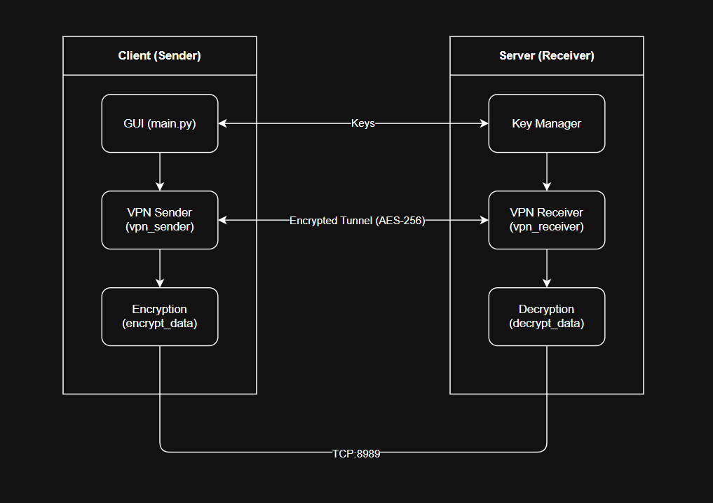
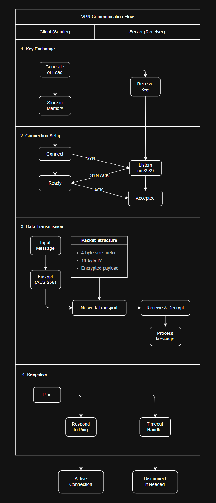
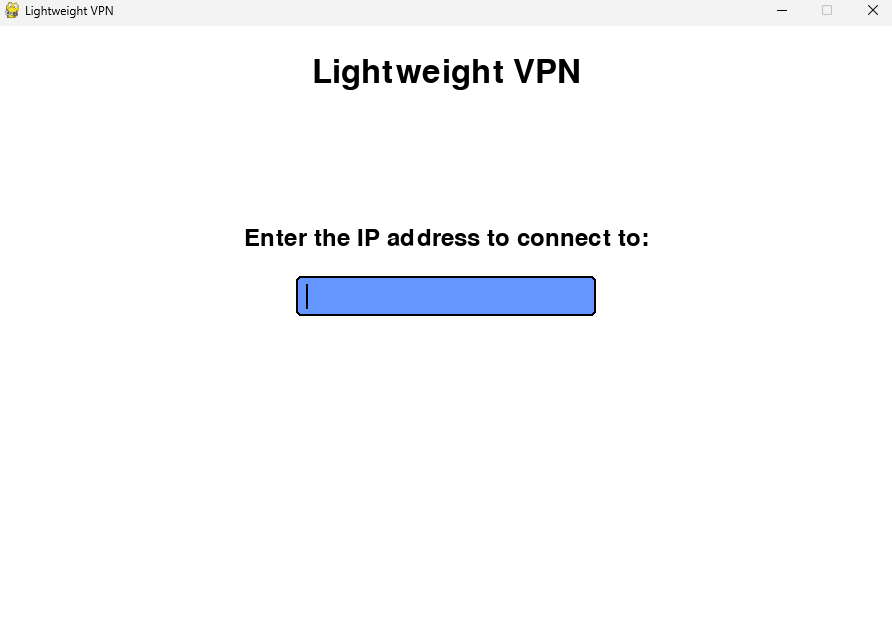
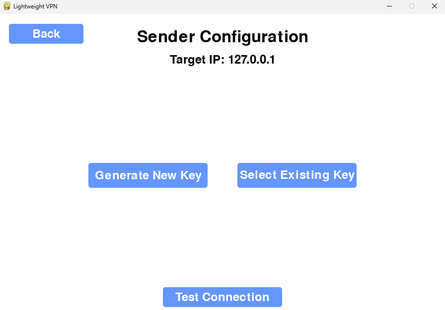
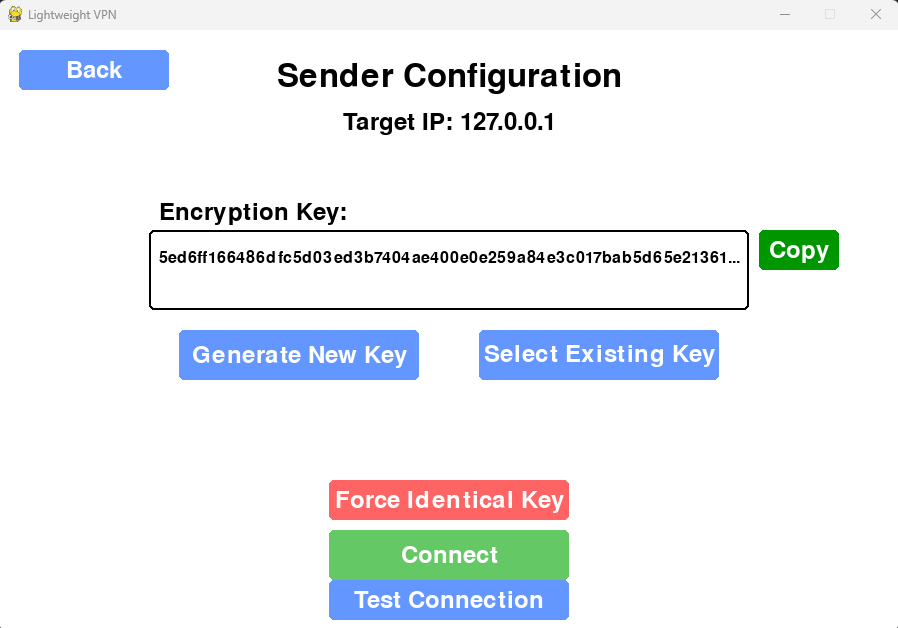
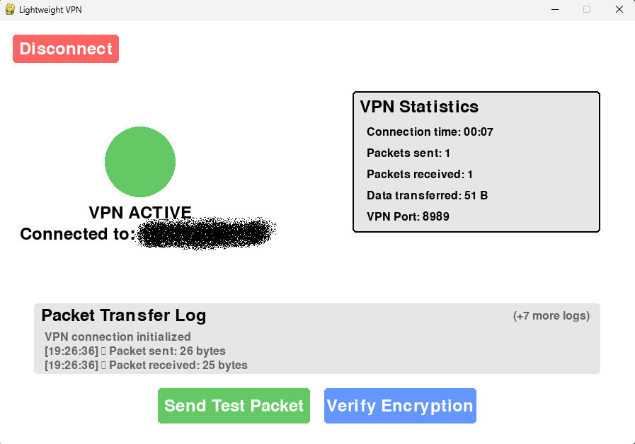
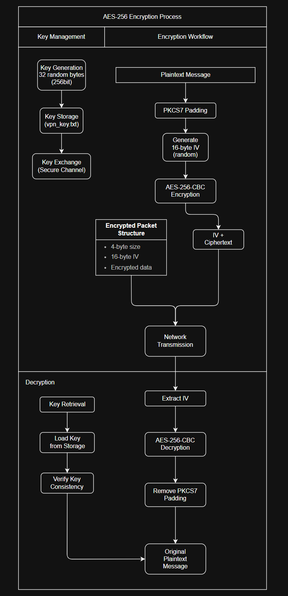
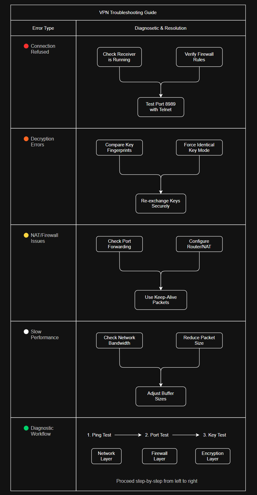

# Lightweight VPN Using Raw Sockets


## 📌 Project Overview

This project is a **secure, lightweight, cross-platform VPN** built using **raw sockets** and **TCP/IP networking**. It provides **end-to-end encrypted communication** between two endpoints through an intuitive graphical interface. Unlike traditional VPNs that modify network stacks or require special privileges, this solution works as a user-space application with minimal dependencies.



Key advantages:
- **Simple to use**: User-friendly GUI with clear connection indicators
- **No configuration files**: Visual management of all settings
- **Cross-platform**: Works identically on Windows and Linux
- **No installation required**: Run from a single executable file
- **AES-256 military-grade encryption**: Secure your communications

## 🔥 Features

- **End-to-End Encryption** using AES-256 with CBC mode
- **Raw Socket Communication** for direct TCP packet tunneling
- **Interactive GUI** with real-time connection statistics
- **Cross-Platform Support** (Windows & Linux) with identical behavior
- **Secure Key Management** with multiple sharing options
- **Connection Testing** to validate network connectivity
- **Encryption Verification** to ensure security
- **NAT Traversal** capabilities for connecting through firewalls
- **Network Scanning** to discover potential VPN peers
- **Packet Logging** for monitoring and debugging

## 🚀 How It Works

### Secure Communication Architecture



1. **Sender (Client Mode)**: 
  - Establishes an encrypted tunnel to the receiver
  - Manages encryption key consistency across platforms
  - Monitors connection status and packet delivery
  - Queues and ensures reliable message delivery

2. **Receiver (Server Mode)**:
  - Listens on specified port for incoming connections
  - Handles multiple simultaneous client connections
  - Decrypts and processes incoming data packets
  - Provides identical encryption capabilities as sender

3. **Encryption System**:
  - Uses **AES-256-CBC** with PKCS7 padding
  - Implements random IV generation for each message
  - Ensures cross-platform key consistency
  - Provides multiple verification mechanisms

4. **Connection Management**:
  - Auto-reconnection capabilities
  - Connection testing and verification
  - TCP keepalive for NAT traversal
  - Packet queuing for reliability

## 🛠️ Installation & Setup

### 1️⃣ Clone the Repository

```bash
git clone https://github.com/sasukeuchiha14/lightweight-vpn-raw-sockets.git
cd lightweight-vpn-raw-sockets
```

### 2️⃣ Install Dependencies

The application requires only two external libraries:
```bash
pip install -r requirements.txt
```

Required packages:
- **pygame**: For the user interface (2.5.2)
- **pycryptodome**: For AES encryption (3.19.0)

### 3️⃣ Run the Application

Launch the main application:
```bash
python main.py
```

This will open the graphical interface where you can configure and manage your VPN connections.



## 🖥️ Using the Application

### Setting Up a Connection



1. **Enter IP Address**: 
  - Input the IP address of the machine you want to connect to
  - For local testing, you can use `127.0.0.1`

2. **Select Connection Mode**:
  - **Send Mode**: Acts as the client initiating the connection
  - **Receive Mode**: Acts as the server waiting for connections

3. **Key Management**:
  - **Generate New Key**: Creates a fresh AES-256 encryption key
  - **Select Existing Key**: Choose a previously saved key file
  - **Upload Key**: Load a key shared by your communication partner
  - **Copy Key**: Share your key securely with your partner



4. **Connection Testing**:
  - Test connectivity before establishing a VPN tunnel
  - Verify the remote machine is reachable
  - Confirm the VPN port is open and accessible

5. **Establish Connection**:
  - Click "Connect" to establish the secure VPN tunnel
  - The status indicator will turn green when connected
  - Real-time statistics will show connection health

### Using the VPN



Once connected, the application will display:
- **Connection Status**: Active/Inactive indicator
- **Statistics**: Packets sent/received, data transferred, connection time
- **Packet Log**: Real-time monitoring of data transfers
- **Test Functions**: Send test packets, verify encryption

To disconnect:
- Click the "Disconnect" button
- The application will properly terminate the connection

## 🔒 Security & Encryption

### Key Management System



The VPN uses a sophisticated key management system that ensures consistent encryption across platforms:

- **256-bit AES Keys**: Provides military-grade encryption strength
- **In-Memory Key Storage**: Prevents key leakage and ensures consistency
- **Key Verification**: Cryptographic fingerprinting to verify key matching
- **Platform-Independent Format**: Guarantees identical encryption on all systems
- **Manual Key Exchange**: Keeps keys under user control for maximum security

### Security Features

- **Fully Encrypted Tunnel**: All data is encrypted with AES-256-CBC
- **Random IV Generation**: Each message uses a unique initialization vector
- **Key Fingerprinting**: Visual verification of key consistency
- **Encryption Testing**: Built-in verification of encryption integrity
- **No Central Servers**: Direct peer-to-peer connections only

## 🛠️ Troubleshooting

### Common Issues and Solutions



- **Connection Refused**: 
  - Check if receiver is running
  - Verify firewall settings allow port 8989
  - Use the "Test Connection" feature to diagnose

- **Decryption Errors**: 
  - Ensure both sides use the exact same encryption key
  - Use "Verify Encryption" to check key fingerprints
  - Try the "Force Identical Key" option

- **NAT/Firewall Issues**:
  - Configure port forwarding for port 8989 on your router
  - Try connecting from a different network
  - Check if your ISP blocks custom VPN connections

- **Network Scanning Not Working**:
  - Some networks block ARP scanning
  - Try manually entering the IP address

## 📂 Project Structure

```
lightweight-vpn-raw-sockets/
├── main.py                  # Main application with GUI interface
├── vpn.py                   # Core VPN connectivity implementation
├── encryption.py            # Encryption and key management
├── network_scanner.py       # Network discovery functionality
├── ui_components.py         # GUI component drawing functions
├── utils.py                 # Utility functions for clipboard and keys
├── requirements.txt         # Required dependencies
└── vpn_key.txt              # Generated key file (if exists)
```

## 💡 Future Enhancements

- **Multi-user Support**: Allow multiple simultaneous connections
- **Traffic Shaping**: Bandwidth control and QoS features
- **Authentication System**: Enhanced connection security
- **Web Interface Option**: Alternative to the Pygame GUI
- **File Transfer**: Direct secure file sharing capabilities
- **Port Configuration**: Custom port selection
- **Data Compression**: Reduce bandwidth usage
- **Mobile App**: Android and iOS client applications
- **Network Interface Bridging**: True network-level VPN functionality

## 📜 License

This project is licensed under the **MIT License**. See the `LICENSE` file for details.

---

🚀 **Contributions Welcome!** 

Feel free to open issues or submit pull requests if you have suggestions or improvements. Your feedback and contributions help make this project better for everyone!

### Contributors

- Hardik Garg - Project Creator

### Support

For questions and support, please open an issue on the GitHub repository.